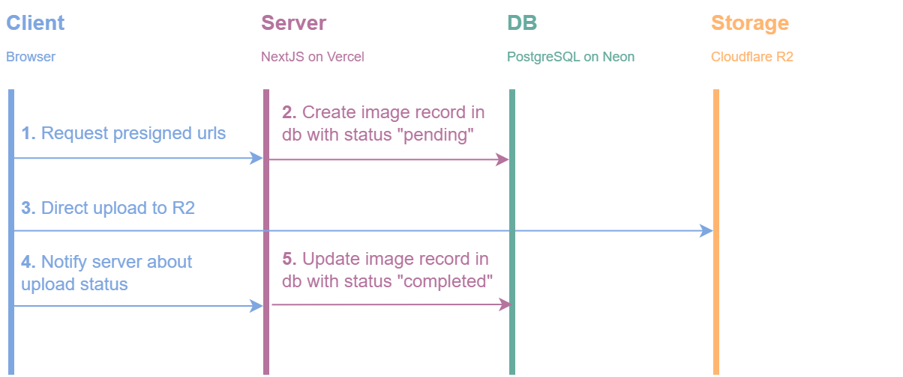

# Image Upload with Neon & Cloudflare R2

This project demonstrates a full image upload flow in a Next.js app using Cloudflare R2 for storage and Neon for storing image metadata in a Postgres database. It includes secure direct-to-R2 uploads with pre-signed URLs, image optimization and size limiting, and a clean UI built with shadcn/ui. The interface features drag-and-drop uploads, live previews, and a simple table displaying image metadata with preview, download, and delete options.

## What This Project Does

This is a full-stack image upload application that allows users to:
- **Upload multiple images** (up to 5 at once) via drag-and-drop or file selection
- **Automatically optimize images** by converting to WebP format and compressing to stay under size limits
- **View uploaded images** in a responsive table with metadata
- **Track upload progress** with real-time progress bars and timing information
- **Handle upload failures** gracefully with status tracking

## Upload Flow Architecture



The application uses a secure 3-step upload process:

### 1. **Presign Phase** (`/api/images/presign`)
- Client prepares images (converts to WebP, optimizes size)
- Server generates presigned URLs for direct R2 uploads
- Database records are created with `pending` status
- Returns presigned URLs and metadata to client

### 2. **Upload Phase** (Direct to R2)
- Client uploads images directly to Cloudflare R2 using presigned URLs
- No server involvement - reduces bandwidth and improves performance
- Real-time progress tracking for each image
- Parallel uploads for better performance

### 3. **Confirm Phase** (`/api/images/confirm`)
- Client reports upload results (success/failure) to server
- Server updates database records with final status (`completed` or `failed`)
- Batch updates for efficiency

## Technologies Used

### Backend
- **[Next.js 15](https://nextjs.org/)** - React framework with App Router
- **[Neon](https://neon.tech/)** - Serverless PostgreSQL database
- **[Drizzle ORM](https://orm.drizzle.team/)** - TypeScript ORM for database operations
- **[Cloudflare R2](https://developers.cloudflare.com/r2/)** - Object storage for images
- **[AWS SDK](https://aws.amazon.com/sdk-for-javascript/)** - S3-compatible client for R2
- **[Zod](https://zod.dev/)** - TypeScript-first schema validation

### Frontend
- **[React 19](https://react.dev/)** - UI framework
- **[TypeScript](https://www.typescriptlang.org/)** - Type safety
- **[Tailwind CSS](https://tailwindcss.com/)** - Utility-first CSS framework
- **[React Query](https://tanstack.com/query/latest)** - Data fetching and caching
- **[React Dropzone](https://react-dropzone.js.org/)** - Drag-and-drop file uploads
- **[Radix UI](https://www.radix-ui.com/)** - Accessible component primitives
- **[Lucide React](https://lucide.dev/)** - Icon library
- **[Sonner](https://sonner.emilkowal.ski/)** - Toast notifications

### Developer Tools
- **[Drizzle Kit](https://orm.drizzle.team/kit-docs/overview)** - Database migrations
- **[ESLint](https://eslint.org/)** - Code linting
- **[Turbopack](https://turbo.build/pack)** - Fast bundler for development

## Key Features

### Image Optimization
- Automatic WebP conversion for better compression
- Quality adjustment to meet size limits
- Maintains aspect ratio while resizing large images
- Configurable maximum file size (default: 1MB)

### Security
- JWT-based authentication for API endpoints
- Presigned URLs with expiration times
- Server-side file size validation with exact size limits per upload URL
- Database operations verify image ownership by user ID
- User-scoped file organization in R2

### Performance
- Direct-to-R2 uploads bypass server bandwidth
- Parallel image processing and uploads
- Batch database operations
- Optimistic UI updates

### User Experience
- Drag-and-drop interface with visual feedback
- Real-time upload progress tracking
- Upload duration timing
- Error handling with user-friendly messages
- Responsive design for all devices

## Prerequisites

This project assumes you have:
- A Neon PostgreSQL database account and project
- A Cloudflare account with R2 storage enabled
- Proper CORS policies configured for your R2 bucket

Account creation and CORS setup are not covered here as they're well-documented in these resources:
- [Cloudflare R2 with Next.js example](https://github.com/diwosuwanto/cloudflare-r2-with-nextjs-upload-download-delete/tree/main)
- [Neon's Cloudflare R2 guide](https://neon.com/docs/guides/cloudflare-r2)
- [Cloudflare R2 pre-signed URLs guide](https://ruanmartinelli.com/blog/cloudflare-r2-pre-signed-urls/)

## Getting Started

1. **Install dependencies:**
   ```bash
   npm install
   ```

2. **Set up environment variables:**
   
   Copy `.env.example` to `.env.local` and fill in your values:
   ```bash
   cp .env.example .env.local
   ```

3. **Run database migrations:**
   ```bash
   npx drizzle-kit push:pg
   ```

4. **Start the development server:**
   ```bash
   npm run dev
   ```

5. **Open [http://localhost:3000](http://localhost:3000)** in your browser

## Project Structure

```
├── app/
│   ├── api/images/          # Image upload API routes
│   │   ├── auth.ts         # Authentication check
│   │   ├── presign/        # Generate presigned URLs for R2 uploads
│   │   │   └── route.ts    
│   │   ├── confirm/        # Confirm upload status
│   │   │   └── route.ts    
│   │   └── files/          # File operations
│   │       └── route.ts    # File management endpoints
│   ├── uploader.tsx         # Main upload component
│   └── page.tsx             # Home page
├── components/ui/           # Reusable UI components
├── db/
│   ├── schema.ts           # Database schema
│   └── operations/         # Database operations
├── lib/
│   ├── images/             # Image processing utilities
│   └── query-options/      # React Query configurations
├── utils/
│   └── r2.ts              # Cloudflare R2 utilities
└── zod/
    └── images.ts          # Validation schemas
```


## License

This project is licensed under the MIT License.
